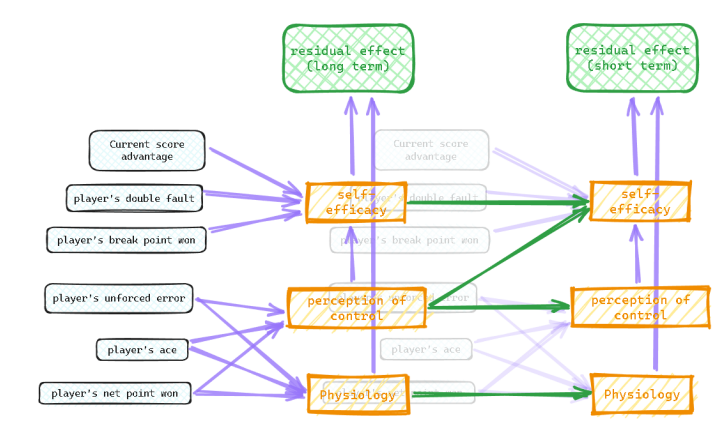
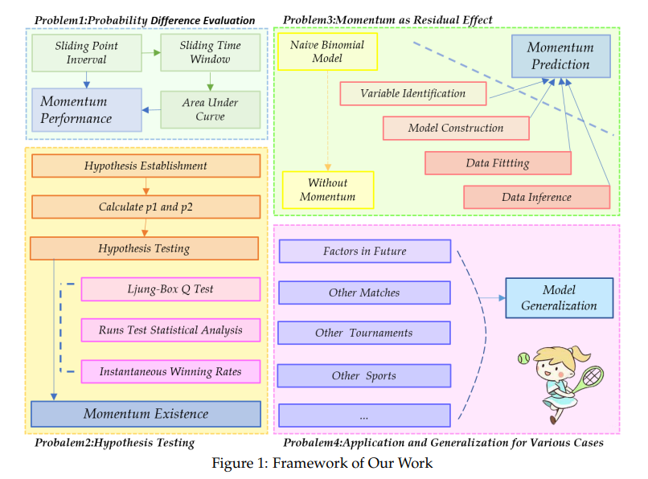

# Dual-Temporal Bayesian Network for Tennis Match Momentum Analysis

## Overview

This repository contains the implementation and analysis of a Dual-Temporal Bayesian Network model designed to investigate the dynamics of momentum in tennis matches. By analyzing data from the Wimbledon 2023 competition and additional datasets, our model addresses several key questions related to performance metrics, momentum existence, prediction, and the application of findings to coaching strategies.





## Repository Structure
```
Dual-Temporal-Bayesian-Network/
├── data
│ └── data_dictionary.csv
│ └── ranking.csv
│ └── Wimbledon_featured_matches.csv
│ └── Wimbledon_women_points.csv
│ └── women_rankings.csv
├── docs
│ ├── award
│ │ └── 2401298.pdf
│ ├── paper
│ │ └── 2401298.pdf
│ ├── Problem
│ │ └── 2024_MCM_Problem_C_FINAL.pdf
├── models
│ ├── Model.bif
│ ├── SingleLayerModel.bif
│ ├── WomanModel.bif
├── scripts
│ ├── Problem1
│ ├── Problem2
│ ├── Problem3
│ │ └── Q3(betterTester).py
│ ├── Problem4
│ ├── getRelativeRanks.py
│ ├── pre_drawMatchRelationGraph.py
│ └── pre_structure.py
└── README.md
```


## Features

- **Performance Metrics**: Implementation of server/returner reweighting and sliding window analysis.
- **Momentum Existence**: Statistical tests (e.g., Ljung-Box Q Test, Runs Test) to explore momentum effects.
- **Momentum Prediction**: Development of a Dual-Temporal Bayesian Network to predict momentum's residual effects.
- **Predictive Analysis**: Validation of the model's predictions against actual match outcomes and exploration of gender-specific dynamics.
- **Coaching Strategies**: Insights and actionable strategies derived from model findings to aid coaches.

## Installation

To set up this project, you only need to clone the repository.

```bash
git clone https://github.com/Team-of-2401298-for-MCM2024/Dual-Temporal-Bayesian-Network.git
```

## Usage
Run scripts associated with each problem statement as follows:
```bash
python scripts/Problem3/Q3(betterTester).py
```

## Contribution
Contributions to this project are welcome. Please fork the repository and submit a pull request with your enhancements.

## License
This project is licensed under the MIT License - see the LICENSE.md file for details.

Contact
For any queries, please open an issue in the repository, and we will get back to you as soon as possible.

Acknowledgements
Wimbledon Data Science Team for the dataset.
Contributors who have provided insights and reviews on the methodologies.